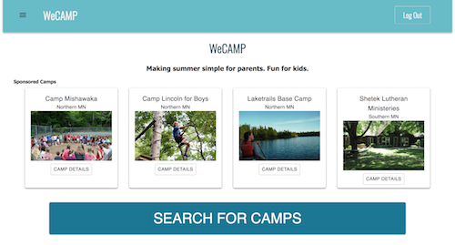

# WeCAMP

This app will provide one place where parents can find camps and activities for their children, organize their summer itinerary and share that information. The robust search will allow you to narrow down to the camps that suit your children, by activity, type, location, etc. The itinerary will make it easier to organize events and activities planned throughout the summer. The site will also allow you to easily share that information with the parents of your children’s friends to facilitate coordination. 

# Built With

This project uses React, Redux, Express, Passport, and PostgreSQL (a full list of dependencies can be found in `package.json`).


# Getting Started

Before you get started, make sure you have the following software installed on your computer:

- [Node.js](https://nodejs.org/en/)
- [PostrgeSQL](https://www.postgresql.org/)
- [Nodemon](https://nodemon.io/)

## Create database and tables

* Create a new database called `wecamp`. Copy and paste the SQL from the database.sql into a
new SQL query. All inserts must be done in order from top to bottom in the database.sql due to dependencies. 

* Open the dummydata.sql copy and paste the contents into a new SQL query. 

* In the table `camp` go to the `sponsored` column and change a couple camps to TRUE so they will show on the homepage. 


## Development Setup Instructions

* Run `npm install`
* Create a `.env` file at the root of the project and paste this line into the file:
    ```
    SERVER_SESSION_SECRET=superDuperSecret
    ```
    While you're in your new `.env` file, take the time to replace `superDuperSecret` with some long random string like `25POUbVtx6RKVNWszd9ERB9Bb6` to keep your application secure. Here's a site that can help you: [https://passwordsgenerator.net/](https://passwordsgenerator.net/). If you don't do this step, create a secret with less than eight characters, or leave it as `superDuperSecret`, you will get a warning.

* Start postgres if not running already by using `brew services start postgresql`
* Run `npm run server`
* Run `npm run client`
* Navigate to `localhost:3000`
* Register for an account and login "username will be your email address."
* Once logged in the homepage will look like this
* 


# Authors

* Brit Carter
* Tang Yang
* Erin Olson
* Nick Neiert


